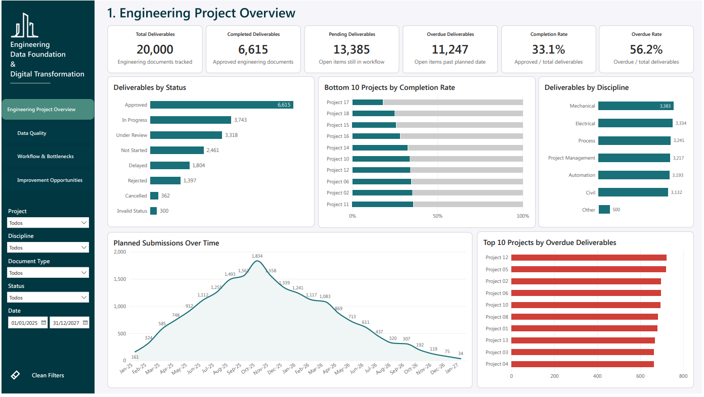
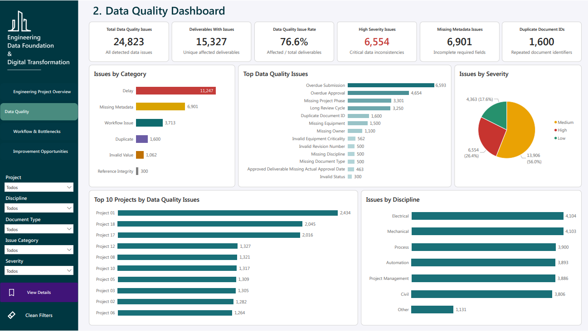
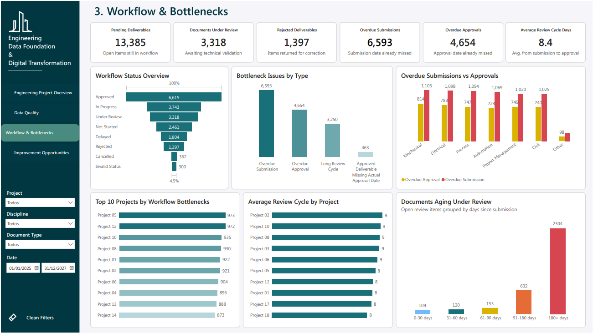
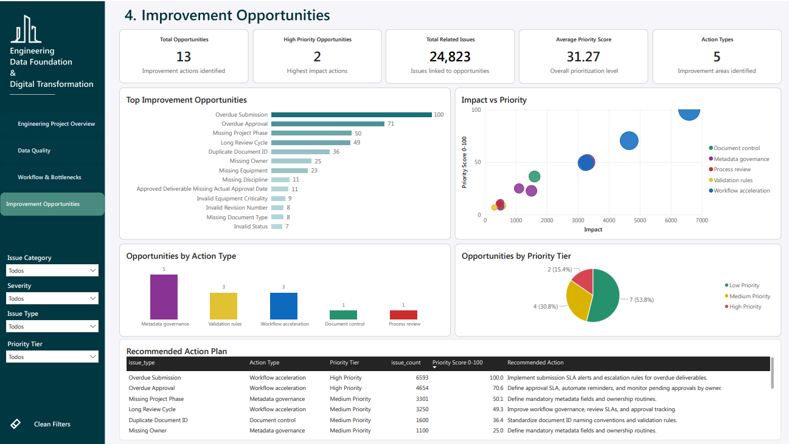

# Engineering Data Foundation & Digital Transformation Dashboard

## Project Overview

This project simulates an end-to-end **Engineering Data Foundation** for monitoring engineering deliverables, data quality issues, workflow bottlenecks, and improvement opportunities.

The objective is to demonstrate how data engineering, SQL analytics, and Power BI can be used to improve visibility, governance, and decision-making in engineering project environments.

The solution covers the full analytics lifecycle:

- Synthetic data generation with Python
- Relational data modeling in PostgreSQL
- SQL-based data quality checks
- Analytical views for reporting
- Power BI dashboard development
- Workflow bottleneck analysis
- Improvement opportunity prioritization

The project was designed to reflect a realistic digital transformation scenario in engineering operations, where multiple teams, disciplines, documents, and approval workflows need to be monitored through reliable data.

---

## Business Context

Engineering projects usually involve a high volume of technical documents, drawings, specifications, validation documents, equipment data, and approval workflows.

When this information is spread across different systems or manually controlled, common problems may appear:

- Lack of visibility over document status
- Missing metadata and ownership gaps
- Delayed submissions and approvals
- Long review cycles
- Duplicate document identifiers
- Inconsistent workflow status
- Low trust in reporting outputs

This project addresses these challenges by creating a structured data foundation and an analytical dashboard to help teams monitor engineering deliverables and identify improvement opportunities.

---

## Business Questions

The project aims to answer the following questions:

1. What is the overall status of engineering deliverables?
2. How many deliverables are completed, pending, or overdue?
3. Which projects and disciplines concentrate the highest volume of deliverables?
4. What are the most common data quality and workflow issues?
5. Which projects have the highest concentration of issues?
6. Where are the main workflow bottlenecks?
7. Which improvement actions should be prioritized first?

---

## Dataset

The dataset is synthetic and was generated using Python.

It simulates:

- 20,000 engineering deliverables
- Multiple engineering projects
- Engineering disciplines
- Document types
- Equipment records
- Responsible engineers
- Workflow statuses
- Planned and actual submission dates
- Planned and actual approval dates
- Data quality and workflow issues

No real company data or confidential information is used.

---

## Tools and Technologies

| Area | Tools |
|---|---|
| Data generation | Python, pandas, NumPy |
| Database | PostgreSQL |
| Data analysis | SQL |
| Data modeling | Relational model, analytical views |
| Business intelligence | Power BI |
| Version control | Git, GitHub |
| Documentation | Markdown |

---

## Project Structure

```text
engineering-data-foundation-digital-transformation/
│
├── data/
│   ├── raw/
│   └── processed/
│
├── python/
│   ├── config.py
│   ├── dimensions.py
│   ├── fact_deliverables.py
│   ├── data_quality.py
│   ├── export.py
│   └── main.py
│
├── sql/
│   ├── 01_create_tables.sql
│   ├── 02_data_quality_checks.sql
│   └── 03_analytical_views.sql
│
├── pbi/
│   ├── DashboardEngineering.pbix
│   └── DashboardEngineering.pdf
│
├── images/
│   ├── page_1_overview.png
│   ├── page_2_data_quality.png
│   ├── page_3_workflow_bottlenecks.png
│   └── page_4_improvement_opportunities.png
│
├── README.md
└── data_dictionary.md
```

---

## Data Pipeline

The project follows this pipeline:

```text
Python synthetic data generation
        ↓
CSV export
        ↓
PostgreSQL raw tables
        ↓
SQL data quality checks
        ↓
SQL analytical views
        ↓
Power BI dashboard
        ↓
Business insights and recommendations
```

---

## Data Model

The model includes fact and dimension-style tables.

Main entities:

- Projects
- Disciplines
- Document types
- Equipment
- Engineers
- Statuses
- Engineering deliverables
- Data quality issues
- Improvement opportunities

Main analytical views used in Power BI:

| View | Purpose |
|---|---|
| `vw_deliverables_overview` | Main deliverable-level reporting view |
| `vw_data_quality_issue_rows` | One row per detected issue |
| `vw_improvement_opportunities` | Prioritized improvement opportunities |
| `vw_engineering_workflow_status` | Workflow status analysis |

---

## Dashboard Pages

The Power BI dashboard contains four pages.

### 1. Engineering Project Overview

This page provides an executive overview of engineering deliverables.

Main KPIs:

- Total deliverables
- Completed deliverables
- Pending deliverables
- Overdue deliverables
- Completion rate
- Overdue rate

Main visuals:

- Deliverables by status
- Bottom 10 projects by completion rate
- Deliverables by discipline
- Planned submissions over time
- Top 10 projects by overdue deliverables



---

### 2. Data Quality Dashboard

This page identifies data quality and workflow-related issues across engineering deliverables.

Main KPIs:

- Total data quality issues
- Deliverables with issues
- Data quality issue rate
- High severity issues
- Missing metadata issues
- Duplicate document IDs

Main visuals:

- Issues by category
- Top data quality issues
- Issues by severity
- Top 10 projects by data quality issues
- Issues by discipline



---

### 3. Workflow & Bottlenecks

This page focuses on operational workflow bottlenecks.

Main KPIs:

- Pending deliverables
- Documents under review
- Rejected deliverables
- Overdue submissions
- Overdue approvals
- Average review cycle days

Main visuals:

- Workflow status overview
- Bottleneck issues by type
- Overdue submissions vs approvals
- Top 10 projects by workflow bottlenecks
- Average review cycle by project
- Documents aging under review



---

### 4. Improvement Opportunities

This page translates detected issues into prioritized improvement actions.

Main KPIs:

- Total opportunities
- High priority opportunities
- Total related issues
- Average priority score
- Action types

Main visuals:

- Top improvement opportunities
- Impact vs priority
- Opportunities by action type
- Opportunities by priority tier
- Recommended action plan



---

## Key Insights

The analysis identified several important findings:

- Only **33.1%** of engineering deliverables are completed.
- **56.2%** of deliverables are overdue.
- **76.6%** of deliverables have at least one data quality or workflow-related issue.
- The largest issue categories are delay, missing metadata, and workflow issues.
- Missing metadata represents a significant governance problem, with issues such as missing project phase, missing equipment, missing owner, missing discipline, and missing document type.
- The workflow contains a relevant approval backlog, with many documents under review for long periods.
- The highest priority improvement opportunities are related to overdue submissions, overdue approvals, metadata governance, and long review cycles.

---

## Improvement Recommendations

Based on the analysis, the main recommended actions are:

### 1. Implement submission SLA alerts

Create automated alerts for deliverables approaching or exceeding their planned submission date.

Expected impact:

- Reduce overdue submissions
- Improve visibility over pending deliverables
- Support proactive follow-up with responsible teams

---

### 2. Improve approval workflow monitoring

Define approval SLAs and automate reminders for documents waiting for approval.

Expected impact:

- Reduce overdue approvals
- Improve review cycle performance
- Increase accountability across approvers

---

### 3. Strengthen metadata governance

Define mandatory fields and validation rules for key metadata, such as project phase, owner, equipment, discipline, and document type.

Expected impact:

- Improve reporting reliability
- Reduce incomplete records
- Increase trust in dashboard outputs

---

### 4. Standardize document ID controls

Apply validation rules to prevent duplicate document identifiers.

Expected impact:

- Improve document traceability
- Reduce ambiguity in reporting
- Strengthen document control processes

---

### 5. Monitor long review cycles

Track documents that remain under review for excessive periods and define escalation rules.

Expected impact:

- Reduce accumulated review backlog
- Improve decision speed
- Increase workflow transparency

---

## Example SQL Logic

The project uses SQL to identify issues such as:

- Missing metadata
- Duplicate document IDs
- Invalid statuses
- Overdue submissions
- Overdue approvals
- Long review cycles
- Missing approval dates
- Invalid revision numbers

Example analytical approach:

```sql
SELECT
    issue_type,
    issue_category,
    severity,
    COUNT(*) AS issue_count,
    COUNT(DISTINCT deliverable_id) AS affected_deliverables
FROM engineering_data.vw_data_quality_issue_rows
GROUP BY
    issue_type,
    issue_category,
    severity
ORDER BY
    issue_count DESC;
```

---

## Power BI Measures

Some of the main DAX measures used in the dashboard include:

```DAX
Total Deliverables =
DISTINCTCOUNT(vw_deliverables_overview[deliverable_id])
```

```DAX
Completed Deliverables =
CALCULATE(
    [Total Deliverables],
    vw_deliverables_overview[is_completed] = TRUE()
)
```

```DAX
Pending Deliverables =
CALCULATE(
    [Total Deliverables],
    vw_deliverables_overview[is_pending] = TRUE()
)
```

```DAX
Overdue Deliverables =
CALCULATE(
    [Total Deliverables],
    vw_deliverables_overview[is_overdue] = TRUE()
)
```

```DAX
Completion Rate =
DIVIDE(
    [Completed Deliverables],
    [Total Deliverables]
)
```

```DAX
Overdue Rate =
DIVIDE(
    [Overdue Deliverables],
    [Total Deliverables]
)
```

```DAX
Total Data Quality Issues =
COUNTROWS(vw_data_quality_issue_rows)
```

```DAX
Deliverables With Issues =
DISTINCTCOUNT(vw_data_quality_issue_rows[deliverable_id])
```

```DAX
Data Quality Issue Rate =
DIVIDE(
    [Deliverables With Issues],
    [Total Deliverables]
)
```

---

## How to Run the Project

### 1. Generate the synthetic dataset

Run the Python script:

```bash
python python/main.py
```

This creates the CSV files used as source data.

---

### 2. Create the PostgreSQL tables

Run:

```sql
sql/create_tables.sql
```

---

### 3. Import the generated CSV files into PostgreSQL

Import the generated CSV files into the corresponding database tables.

---

### 4. Run data quality checks

Run:

```sql
sql/0data_quality_checks.sql
```

---

### 5. Create analytical views

Run:

```sql
sql/analytical_views.sql
```

---

### 6. Export analytical views

Export the main reporting views to CSV and load them into Power BI:

- `vw_deliverables_overview`
- `vw_data_quality_issue_rows`
- `vw_improvement_opportunities`
- `vw_engineering_workflow_status`

---

### 7. Open the Power BI file

Open:

```text
pbi/DashboardEngineering.pbix
```

Refresh the data sources if needed.

---

## Skills Demonstrated

This project demonstrates:

- Python data generation
- Data modeling
- SQL table creation
- SQL data quality checks
- Analytical SQL views
- PostgreSQL usage
- Power BI dashboard design
- DAX measures
- Data quality analysis
- Workflow bottleneck analysis
- Business insight generation
- Improvement recommendation prioritization
- End-to-end analytics project documentation

---

## Portfolio Summary

Built an end-to-end Engineering Data Foundation project using Python, PostgreSQL, SQL, and Power BI to simulate and analyze 20,000 engineering deliverables.

The solution identifies data quality issues, workflow bottlenecks, overdue documents, and improvement opportunities, supporting better governance, reporting reliability, and process optimization in engineering project environments.

---

## Disclaimer

This project uses synthetic data created for portfolio and learning purposes.  
No real company, employee, project, or confidential engineering information is included.
